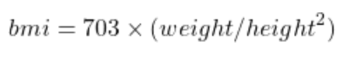

# Problem Set 2
### Due Friday, February 6, 2021, at 11:59pm EST

For this problem set, you will submit to Canvas **a single .zip file**. Detailed instructions for what the .zip file should contain are at the end of this problem set. Note that if you do not submit the files as specified here, there will be a major deduction in your grade for this assignment. Following directions to the letter is a crucial skill for computer programming.

## Getting started

1. If you haven't already, create a folder called `CS1` on your Desktop, in your Documents, or in some place that is easy to find on your computer.

2. In that folder, create a folder called `ps2`. You will put all of the components required for this problem set in the `ps2` folder.

3. Launch IDLE.

## Part 1: Strings

1. In the IDLE Shell, create a variable `mystring` and set its value to `"snowpocalypse"`. 

2. Write a command to print out the string's length, which is 13.

3. Write a command to print out the first letter of the string, which is "s".

4. Write a command to print out the last letter of the string, which is "e".

5. Create a variable called `middle` and use a mathematical operation to identify the location of the middle character of the string. The middle character of "snowpocalypse" is "c". It is the 7th letter in the string, but remember that Python starts counting from 0, so it will be the character at "index 6". 

6. Write a command to print out that middle character using the variable you created in step 5.

7. Write a command to print out `"snowpocalypsesnowpocalypse"` using the `mystring` variable.

8. Open a new file in IDLE (`File -> New File`). Save the file in your `ps2` directory, and call it `part1.py`.

9. Paste each of the above commands, in the order specified, into your `part1.py` file.

10. At the top of the file, write four comments:

* The name of the file.
* Your name.
* The date.
* A statement saying "This code is my own work. I did not share my code or look at the code of another student."

11. Save the file, select `Run -> Run Module`. The output should look like this

```
=================== RESTART: /Users/emilypx/Desktop/part1.py ===================
13
s
e
c
snowpocalypsesnowpocalypse
```


## Part 2: Numbers

1. Create a new file called `part2.py`. This program will calculate a user's BMI based on their height in inches and their weight in pounds.

2. At the top, add these four comments: 

* The name of the file.
* Your name.
* The date.
* A statement saying "This code is my own work. I did not share my code or look at the code of another student."

3. The first line of the program program should use `input` to ask the user for his height in inches and save it as a variable `height`. *(If you don't know how to do this, please see Lab 1! Don't forget that `input` will make a string, but you will need an integer to do calculations.)*

4. The second line of the program program should use `input` ask the user for his weight in pounds and save it as a variable `weight`. 

5. Next write a line of code that calculates BMI according to the following forumula:



6. Using `print` report to the user their BMI and tell them they look great.

---

## What to turn in
In your `ps2` folder you should have two python scripts: `part1.py` and `part2.py`. Remove any other things you might have accidentally put in the folder, then zip the folder up using whatever means you normally use to zip things up (e.g., on a Mac, you can right click and select `Compress`).

Upload the `.zip` file you created to Canvas. 

Note that if you do not submit the files as specified here, there will be a major deduction in your grade for this assignment. Following directions to the letter is a crucial skill for computer programming.

### This problem set is due Friday, February 6, 2021, at 11:59pm EST


